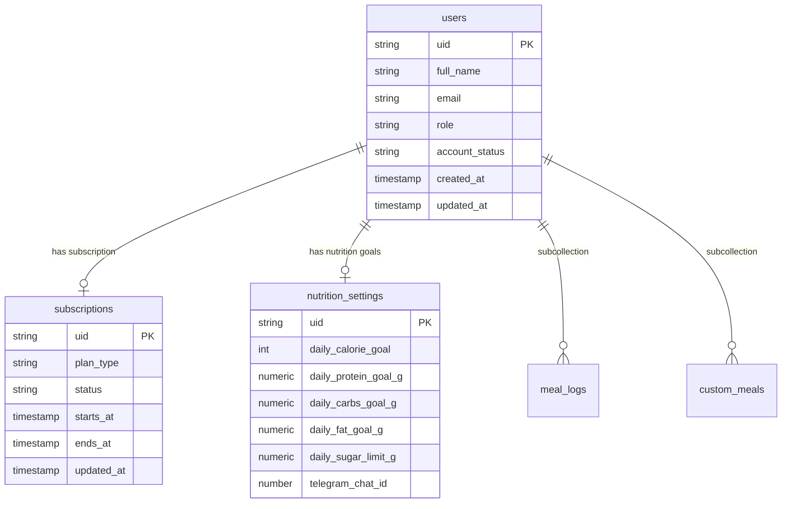

# توثيق قاعدة البيانات (Firebase Firestore Collections)

يعتمد النظام بالكامل على قاعدة بيانات **Firebase Firestore (NoSQL)** مصممة لدعم السرعة، الأمان، والتحديثات اللحظية الحية (Real-Time Live Snapshots) بدون الحاجة لإعادة تحميل الصفحة.

---

## 1. هيكل المجموعات (Firestore Collections Structure)

---

## 2. تفاصيل المجموعات (Collections Details)

### 1️⃣ مجموعة `users/{uid}`
تحتوي على البيانات الأساسية لحساب المستخدم:
- `id`: المعرف الفريد للمستخدم في Firebase Auth.
- `full_name`: الاسم الكامل للمستخدم.
- `email`: البريد الإلكتروني.
- `role`: دور المستخدم (`user`, `admin`, `super_admin`).
- `account_status`: حالة الحساب (`active`, `trial`, `expired`, `blocked`).

### 2️⃣ مجموعة `subscriptions/{uid}`
تحتوي على بيانات اشتراك المستخدم وصلاحية الوصول:
- `plan_type`: نوع الخطة (`monthly`, `quarterly`, `yearly`, `lifetime`).
- `status`: حالة الاشتراك الحالية.
- `ends_at`: تاريخ انتهاء الصلاحية والاشتراك.

### 3️⃣ مجموعة `nutrition_settings/{uid}`
تحتوي على أهداف السعرات والماكروز اليومية:
- `daily_calorie_goal`: هدف السعرات الحرارية اليومي.
- `daily_protein_goal_g`: هدف البروتين اليومي (غرام).
- `daily_carbs_goal_g`: هدف الكربوهيدرات اليومي (غرام).
- `daily_fat_goal_g`: هدف الدهون اليومي (غرام).
- `daily_sugar_limit_g`: حد السكر اليومي (غرام).
- `telegram_chat_id`: معرف حساب تليجرام المربوط بالمنصة.

### 4️⃣ المجموعة الفرعية `users/{uid}/meal_logs/{logId}`
تحتوي على سجلات الوجبات المسجلة يومياً من قِبل المستخدم.
